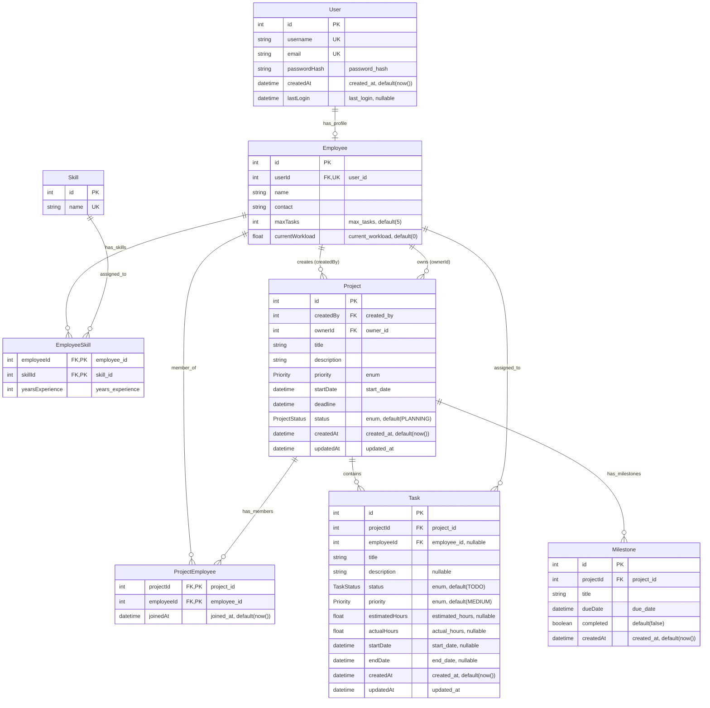

# Database Entity-Relationship Diagram

## Complete ER Diagram for MERN Project Management System

## Entity Details

### **User Entity**

- **Purpose**: Authentication and basic user information
- **Key Features**:
  - Unique username and email
  - Password hash for security
  - Tracks login history
- **Relationships**: One-to-one with Employee

### **Employee Entity**

- **Purpose**: Extended profile for project management
- **Key Features**:
  - Workload management (maxTasks, currentWorkload)
  - Contact information
- **Relationships**:
  - Belongs to one User
  - Can have multiple Skills
  - Can create and own Projects
  - Can be assigned to Tasks
  - Can be member of multiple Projects

### **Skill Entity**

- **Purpose**: Represents technical/professional skills
- **Key Features**:
  - Unique skill names
- **Relationships**: Many-to-many with Employees through EmployeeSkill

### **EmployeeSkill Entity**

- **Purpose**: Junction table linking employees to their skills
- **Key Features**:
  - Tracks years of experience for each skill
  - Composite primary key (employeeId, skillId)
- **Note**: Removed proficiency levels for simplicity

### **Project Entity**

- **Purpose**: Main project management entity
- **Key Features**:
  - Dual ownership model (creator vs current owner)
  - Priority and status tracking
  - Timeline management (startDate, deadline)
- **Relationships**:
  - Created by Employee (createdBy)
  - Owned by Employee (ownerId) - can be transferred
  - Has multiple Tasks and Milestones
  - Has multiple Employee members

### **ProjectEmployee Entity**

- **Purpose**: Junction table for project team members
- **Key Features**:
  - Tracks when employee joined project
  - Composite primary key (projectId, employeeId)

### **Task Entity**

- **Purpose**: Individual work items within projects
- **Key Features**:
  - Optional assignment to employees
  - Time tracking (estimated vs actual hours)
  - Flexible scheduling (optional start/end dates)
  - Priority and status management
- **Relationships**:
  - Belongs to one Project
  - Optionally assigned to one Employee

### **Milestone Entity**

- **Purpose**: Project checkpoints and deliverables
- **Key Features**:
  - Due date tracking
  - Completion status
- **Relationships**: Belongs to one Project

## Enums

### **Priority**

- LOW
- MEDIUM
- HIGH
- CRITICAL

### **ProjectStatus**

- PLANNING
- IN_PROGRESS
- ON_HOLD
- COMPLETED
- CANCELLED

### **TaskStatus**

- TODO
- IN_PROGRESS
- IN_REVIEW
- COMPLETED
- BLOCKED

## Key Design Features

1. **Project Ownership Model**: Anyone can create projects and become the owner
2. **Simplified Skills**: Only tracks skill name and years of experience
3. **Flexible Task Assignment**: Tasks can be unassigned
4. **Dual Project Relationships**: Creator vs Owner allows ownership transfer
5. **Cascade Deletions**: User deletion removes employee profile and all related data
6. **Audit Trail**: Created/updated timestamps on relevant entities
